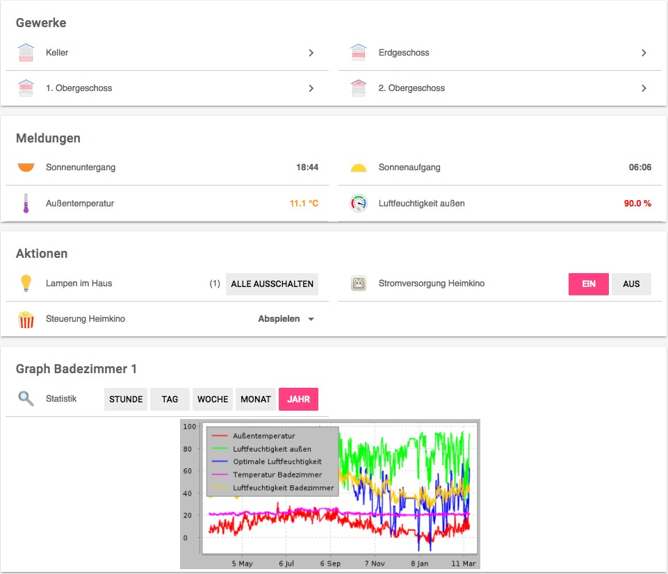

openHAB 2.0.0
=============

What you see here is my new repository for openHAB 2.0.
(The old openHAB repository still remains, but it's frozen).
It corresponds quite often with [my blog](https://www.unixe.de/tag/openhab-2/).

Please keep in mind
-------------------

This repository will probably never be really stable - it ist part of
my running configuration, and it could change often. But perhaps it
gives you an idea how to deal with rules, with items and so on.
